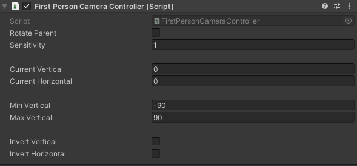

# Unity First Person Controller

Thanks to an answer by [japangreg](www.reddit.com/u/japangreg)  
On reddit: [[C#] Going about scripting a first person camera (in Unity3d)](https://www.reddit.com/r/learnprogramming/comments/2o20ll/c_going_about_scripting_a_first_person_camera_in/)

As this was initially based on it.

Uses legacy input, because I ***cannot*** get the input system to work, and I won't refactor this 
repository to be based on the new input system.

